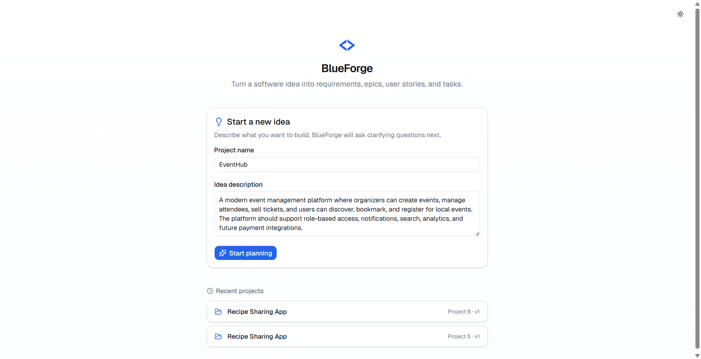
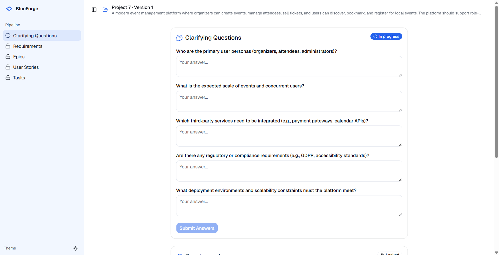
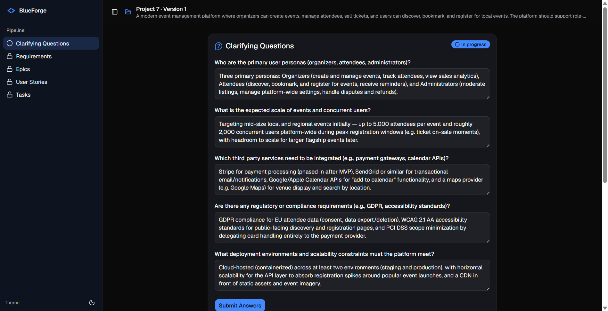
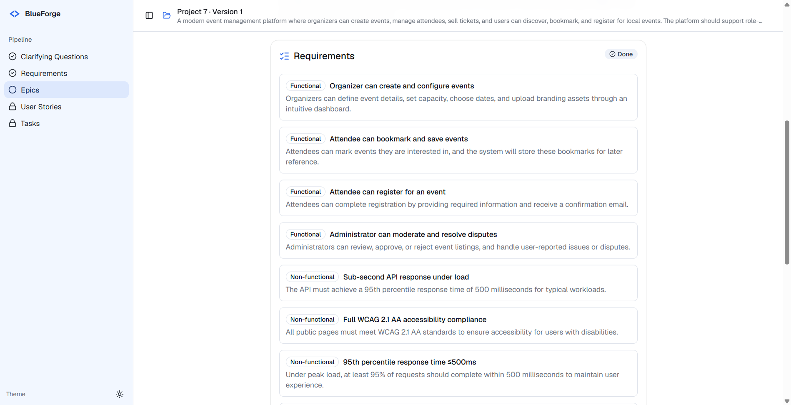
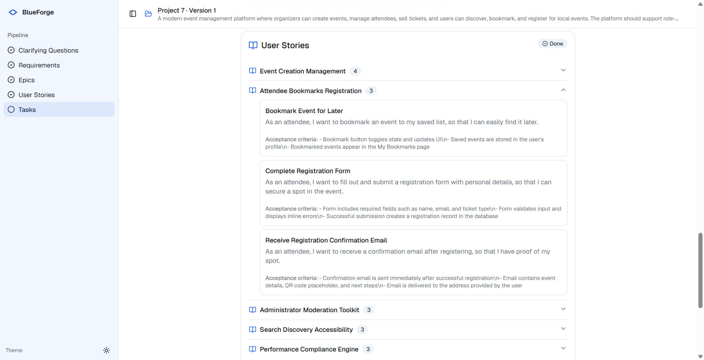
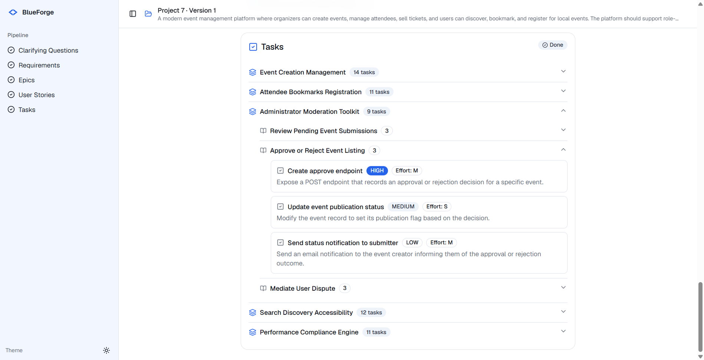
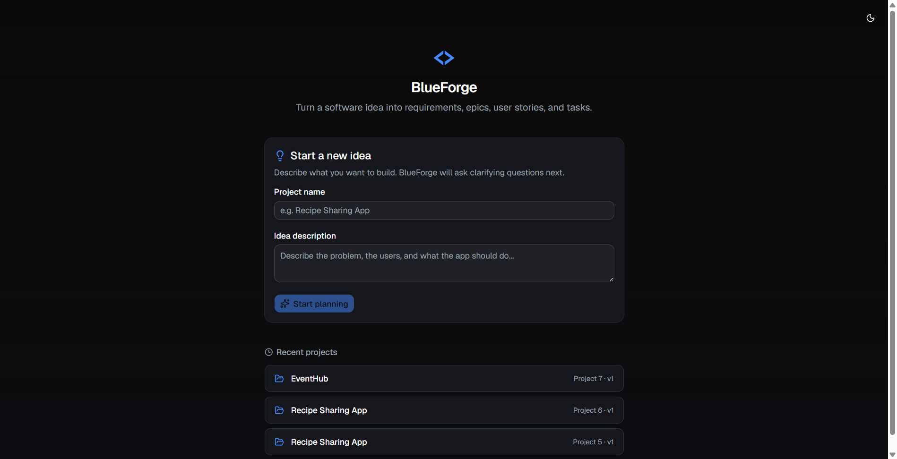
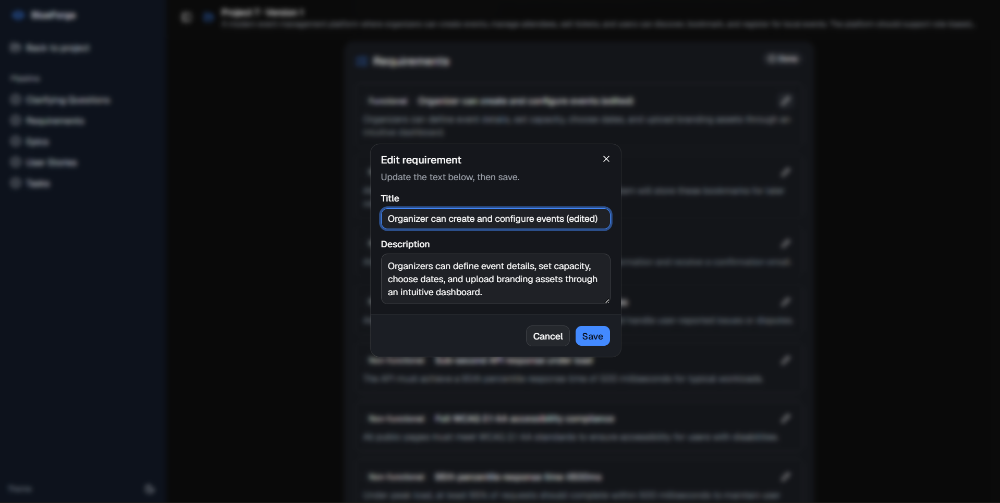
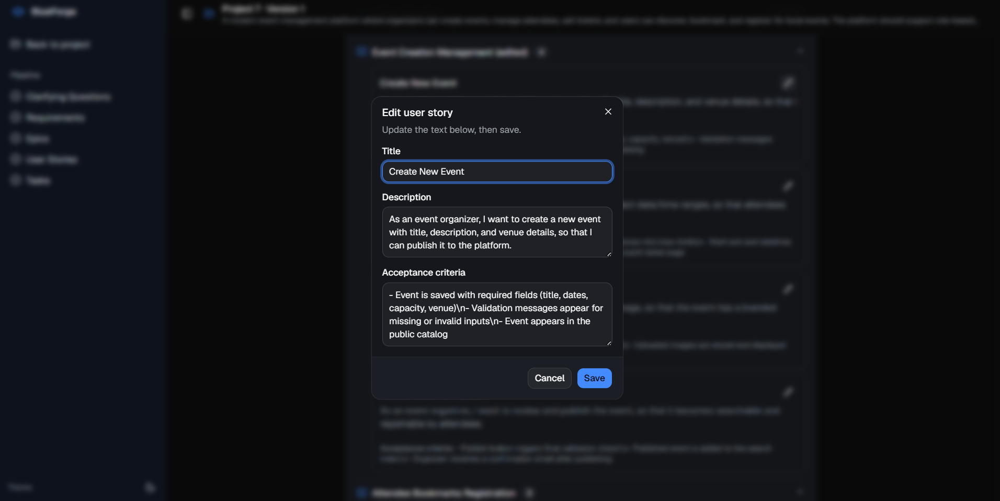

# BlueForge

BlueForge is an AI-powered software planning platform built with Java, Spring Boot, and React.

Instead of generating an entire specification from a single prompt, BlueForge follows an iterative planning workflow. It asks clarifying questions, captures missing requirements, versions every planning step, and gradually transforms an idea into structured technical artifacts.

The project focuses on clean architecture, AI integration, and production-oriented software engineering practices.

---

## Features

### AI Planning Pipeline

- Create software projects from natural language descriptions
- Generate AI-powered clarifying questions
- Generate functional and non-functional requirements
- Generate epics from requirements
- Generate user stories with acceptance criteria
- Generate engineering tasks with priority and effort estimates
- Version every planning stage

### Editing

- Edit the title and description of generated Requirements, Epics, and Tasks
- Edit the title, description, and acceptance criteria of generated User Stories
- Changes save immediately via dedicated PATCH endpoints, no regeneration required

### Regeneration

- Regenerate Requirements, Epics, User Stories, or Tasks for any stage a version has already reached
- Regeneration never overwrites existing data — it creates a new project version instead, leaving the original version and any manual edits in it untouched
- Optional note describing why a stage was regenerated

### Backend

- Layered Spring Boot architecture
- Provider-independent AI abstraction
- Transaction-safe persistence
- Flyway database migrations
- Input validation
- Swagger / OpenAPI documentation
- Docker-based local development

### Frontend

- React + TypeScript + Vite
- Responsive workspace
- Hierarchical Epic → User Story → Task visualization
- Light / Dark / System theme
- Recent Projects
- Dialog-based editing of generated artifacts
- OpenAPI-generated API client
- TanStack Query

---

## Screenshots

### Home



### Clarifying Questions



### Dark Mode



### Requirements



### User Stories



### Tasks



### Home (Dark Mode)



### Editing a Requirement



### Editing a User Story



---

## Architecture

```
                  +----------------+
                  | React Frontend |
                  +-------+--------+
                          |
                          ▼
                 Spring Boot REST API
                          |
                +---------+---------+
                |                   |
                ▼                   ▼
        Application Services    AI Client
                |                   |
                |               OpenRouter
                |
                ▼
        Spring Data JPA
                |
                ▼
            PostgreSQL
```

BlueForge follows a layered architecture where each layer has a single responsibility.

- Controllers expose REST endpoints.
- Services contain business logic.
- Repositories handle persistence.
- AI providers are isolated behind a common interface.
- Prompt templates are stored outside the application code.

---

## Technology Stack

### Backend

| Category | Technology |
|----------|------------|
| Language | Java 21 |
| Framework | Spring Boot 3.5 |
| Database | PostgreSQL |
| ORM | Spring Data JPA |
| Database Migration | Flyway |
| AI Gateway | OpenRouter |
| Build Tool | Maven |
| Testing | JUnit 5 |
| Containerization | Docker |

### Frontend

| Category | Technology |
|----------|------------|
| Language | TypeScript |
| Framework | React 19 + Vite |
| Styling | Tailwind CSS v4 + shadcn/ui |
| Routing | React Router |
| Server State | TanStack Query |
| API Client | Orval (OpenAPI Code Generation) |
| Testing | Vitest + React Testing Library |

---

## Workflow

```
Idea
  │
  ▼
Clarifying Questions
  │
  ▼
Requirements
  │
  ▼
Epics
  │
  ▼
User Stories
  │
  ▼
Tasks
```

Each stage has its own endpoint, AI prompt, persistence model, and project version status.

---

## Project Structure

```
src
├── main
│   ├── java
│   │   └── com.blueforge
│   │       ├── ai
│   │       ├── config
│   │       ├── controller
│   │       ├── dto
│   │       ├── entity
│   │       ├── exception
│   │       ├── repository
│   │       └── service
│   │
│   └── resources
│       ├── db
│       │   └── migration
│       └── prompts
│
└── test

frontend
└── src
    ├── api
    ├── components
    ├── lib
    └── pages

docs
└── architecture
```

---

## API

### Create Project

```
POST /api/projects
```

### Get Project Version

```
GET /api/projects/{projectId}/versions/{versionNumber}
```

### Submit Answers

```
POST /api/projects/{projectId}/versions/{versionNumber}/answers
```

### Generate Epics

```
POST /api/projects/{projectId}/versions/{versionNumber}/epics
```

### Generate User Stories

```
POST /api/projects/{projectId}/versions/{versionNumber}/user-stories
```

### Generate Tasks

```
POST /api/projects/{projectId}/versions/{versionNumber}/tasks
```

### Edit Requirement

```
PATCH /api/requirements/{requirementId}
```

### Edit Epic

```
PATCH /api/epics/{epicId}
```

### Edit User Story

```
PATCH /api/user-stories/{userStoryId}
```

### Edit Task

```
PATCH /api/tasks/{taskId}
```

### Regenerate Version

```
POST /api/projects/{projectId}/versions/{versionNumber}/regenerate
```

Interactive API documentation:

```
http://localhost:8080/swagger-ui/index.html
```

OpenAPI specification:

```
http://localhost:8080/v3/api-docs
```

---

## Running Locally

Clone the repository.

```bash
git clone https://github.com/zeynep-ates/blueforge.git
cd blueforge
```

Start PostgreSQL.

```bash
docker compose up -d
```

Configure environment variables.

```text
OPENROUTER_API_KEY=your_api_key
OPENROUTER_MODEL=your_model
```

Run the backend.

```bash
./mvnw spring-boot:run
```

Run the frontend.

```bash
cd frontend
npm install
npm run dev
```

Frontend:

```
http://localhost:5173
```

Backend:

```
http://localhost:8080
```

---

## Testing

Backend:

```bash
./mvnw verify
```

Frontend:

```bash
cd frontend
npm test
```

---

## Design Decisions

- Flyway is the single source of truth for the database schema.
- Hibernate validates the schema instead of generating it.
- AI providers are isolated behind a common interface.
- Prompt templates are stored outside Java code.
- DTOs are separated from persistence entities.
- Database operations are transactional to guarantee consistency.
- Frontend API types are generated directly from the backend's OpenAPI specification.

Additional documentation is available in:

```
docs/architecture
```

---

## Author

**Zeynep Ateş**

Backend Developer

Java • Spring Boot • React • AI Systems

GitHub: https://github.com/zeynep-ates