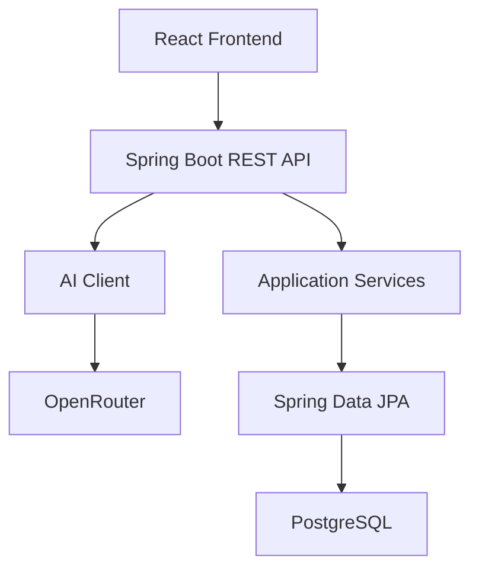
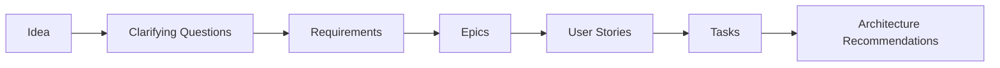

# BlueForge


BlueForge is an AI-powered software planning platform built with Java, Spring Boot, and React.

Instead of generating an entire specification from a single prompt, BlueForge follows an iterative planning workflow. It asks clarifying questions, captures missing requirements, versions every planning step, and gradually transforms an idea into structured technical artifacts.

The project focuses on clean architecture, AI integration, and production-oriented software engineering practices.

---

## Contents

- [Features](#features)
- [Screenshots](#screenshots)
- [Architecture](#architecture)
- [Technology Stack](#technology-stack)
- [Workflow](#workflow)
- [API](#api)
- [Running Locally](#running-locally)
- [Testing](#testing)
- [Design Decisions](#design-decisions)
- [Author](#author)
- [License](#license)

---

## Features

### AI Planning Pipeline

- Create software projects from natural language descriptions
- Generate AI-powered clarifying questions
- Generate functional and non-functional requirements
- Generate epics from requirements
- Generate user stories with acceptance criteria
- Generate engineering tasks with priority and effort estimates
- Generate architecture recommendations — component, recommendation, reasoning, and trade-offs, naming a credible alternative that was considered and rejected
- Version every planning stage

### Editing

- Edit the title and description of generated Requirements, Epics, and Tasks
- Edit the title, description, and acceptance criteria of generated User Stories
- Changes save immediately via dedicated PATCH endpoints, no regeneration required

### Regeneration

- Regenerate Requirements, Epics, User Stories, Tasks, or Architecture Recommendations for any stage a version has already reached
- Regeneration never overwrites existing data — it creates a new project version instead, leaving the original version and any manual edits in it untouched
- Optional note describing why a stage was regenerated

### Version Diffing

- Compare any two versions of the same project
- See which Requirements, Epics, User Stories, Tasks, and Architecture Recommendations were added, removed, or modified, with a summary of counts by change type
- Epics, User Stories, and Tasks are shown as a nested comparison so changes are readable in context, not just as flat lists

### Export

- Export any version's full blueprint as Markdown or JSON — idea, clarifying Q&A, requirements grouped by type, the Epic → User Story → Task roadmap, and architecture recommendations
- Markdown sections for pipeline stages the version hasn't reached yet are simply omitted; JSON export is the same structured response the API already returns for that version
- Downloads directly from the workspace header via an "Export" dropdown

### Authentication

- Optional shared API-key auth, guarding every `/api/**` endpoint — a single secret configured via `BLUEFORGE_API_KEY`, not per-user accounts
- Disabled entirely when unset, so local development needs no setup
- Swagger UI and the OpenAPI spec stay open for exploration regardless

### Backend

- Layered Spring Boot architecture
- Provider-independent AI abstraction
- Transaction-safe persistence
- Flyway database migrations
- Input validation
- Swagger / OpenAPI documentation
- Docker-based local development

### Frontend

- React + TypeScript + Vite
- Responsive workspace
- Hierarchical Epic → User Story → Task visualization
- Light / Dark / System theme
- Recent Projects
- Dialog-based editing of generated artifacts
- OpenAPI-generated API client
- TanStack Query

---

## Screenshots

### Home


### Clarifying Questions


### Dark Mode


### Requirements


### User Stories


### Tasks


### Home (Dark Mode)


### Editing a Requirement


### Editing a User Story


---

## Architecture



BlueForge follows a layered architecture where each layer has a single responsibility.

- Controllers expose REST endpoints.
- Services contain business logic.
- Repositories handle persistence.
- AI providers are isolated behind a common interface.
- Prompt templates are stored outside the application code.

---

## Technology Stack

### Backend

| Category | Technology |
|----------|------------|
| Language | Java 21 |
| Framework | Spring Boot 3.5 |
| Database | PostgreSQL |
| ORM | Spring Data JPA |
| Database Migration | Flyway |
| AI Gateway | OpenRouter |
| Build Tool | Maven |
| Testing | JUnit 5 |
| Containerization | Docker |

### Frontend

| Category | Technology |
|----------|------------|
| Language | TypeScript |
| Framework | React 19 + Vite |
| Styling | Tailwind CSS v4 + shadcn/ui |
| Routing | React Router |
| Server State | TanStack Query |
| API Client | Orval (OpenAPI Code Generation) |
| Testing | Vitest + React Testing Library |

---

## Workflow



Each stage has its own endpoint, AI prompt, persistence model, and project version status.

---

## API

Every endpoint below is under `/api` and requires the `X-API-Key` header when `BLUEFORGE_API_KEY` is configured (see [Authentication](#authentication)).

### Create Project

```
POST /api/projects
```

### Get Project Version

```
GET /api/projects/{projectId}/versions/{versionNumber}
```

### Submit Answers

```
POST /api/projects/{projectId}/versions/{versionNumber}/answers
```

### Generate Epics

```
POST /api/projects/{projectId}/versions/{versionNumber}/epics
```

### Generate User Stories

```
POST /api/projects/{projectId}/versions/{versionNumber}/user-stories
```

### Generate Tasks

```
POST /api/projects/{projectId}/versions/{versionNumber}/tasks
```

### Generate Architecture Recommendations

```
POST /api/projects/{projectId}/versions/{versionNumber}/architecture-recommendations
```

### Edit Requirement

```
PATCH /api/requirements/{requirementId}
```

### Edit Epic

```
PATCH /api/epics/{epicId}
```

### Edit User Story

```
PATCH /api/user-stories/{userStoryId}
```

### Edit Task

```
PATCH /api/tasks/{taskId}
```

### Regenerate Version

```
POST /api/projects/{projectId}/versions/{versionNumber}/regenerate
```

### Compare Versions

```
GET /api/projects/{projectId}/versions/{fromVersion}/diff/{toVersion}
```

### Export Version

```
GET /api/projects/{projectId}/versions/{versionNumber}/export?format=markdown
GET /api/projects/{projectId}/versions/{versionNumber}/export?format=json
```

Interactive API documentation:

```
http://localhost:8080/swagger-ui/index.html
```

OpenAPI specification:

```
http://localhost:8080/v3/api-docs
```

---

## Running Locally

### Prerequisites

- Java 21
- Node.js 18+
- Docker (for PostgreSQL)
- An OpenRouter API key

### 1. Clone the repository

```bash
git clone https://github.com/zeynep-ates/blueforge.git
cd blueforge
```

### 2. Start PostgreSQL

```bash
docker compose up -d
```

### 3. Configure environment variables

```text
OPENROUTER_API_KEY=your_api_key
OPENROUTER_MODEL=your_model
```

OpenRouter's free-tier model slugs are periodically discontinued or rate-limited upstream (see `docs/architecture/sprint-1-summary.md`). If AI calls start failing with a 502, check whether `OPENROUTER_MODEL` (default: `google/gemma-4-26b-a4b-it:free`) is still listed at [openrouter.ai/models](https://openrouter.ai/models) and swap in a currently-available `:free` slug.

Optionally, protect the API with a shared API key (see [Authentication](#authentication) above):

```text
BLUEFORGE_API_KEY=your_chosen_key
```

If `BLUEFORGE_API_KEY` is left unset, the API is open — this is the default for local development.

### 4. Run the backend

```bash
./mvnw spring-boot:run
```

### 5. Run the frontend

```bash
cd frontend
npm install
npm run dev
```

If you set `BLUEFORGE_API_KEY` on the backend, the frontend needs the same value so its requests are authenticated. Create `frontend/.env.local`:

```text
VITE_API_KEY=your_chosen_key
```

Frontend: `http://localhost:5173`
Backend: `http://localhost:8080`

---

## Testing

Backend:

```bash
./mvnw verify
```

Frontend:

```bash
cd frontend
npm test
```

---

## Design Decisions

- Flyway is the single source of truth for the database schema.
- Hibernate validates the schema instead of generating it.
- AI providers are isolated behind a common interface.
- Prompt templates are stored outside Java code.
- DTOs are separated from persistence entities.
- Database operations are transactional to guarantee consistency.
- Frontend API types are generated directly from the backend's OpenAPI specification.

Additional documentation is available in `docs/architecture`.

---

## Author

**Zeynep Ateş**

Backend Developer

Java • Spring Boot • React • AI Systems

GitHub: [zeynep-ates](https://github.com/zeynep-ates)

---

## License

MIT — see [`LICENSE`](LICENSE).